# Enterprise AI Platform — Visual Progress & Architecture Evolution

# 1. Platform Evolution Journey

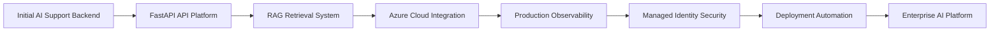

---

# 2. Original Architecture

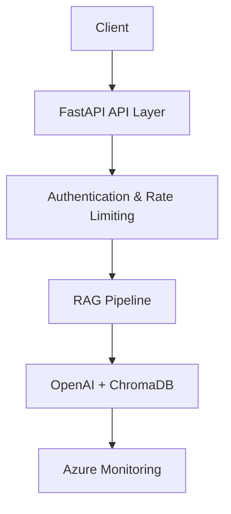

---

# 3. Current Enterprise Architecture

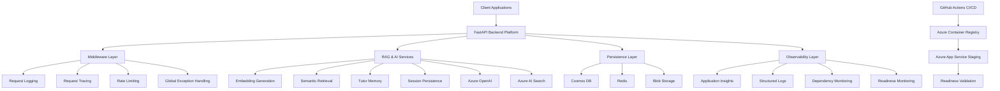

---

# 4. Engineering Maturity Progression

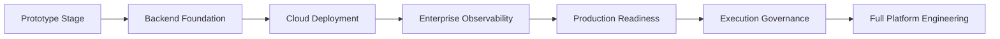

---

# 5. Infrastructure Evolution

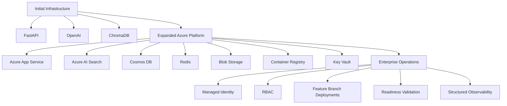

---

# 6. DevOps & Deployment Evolution

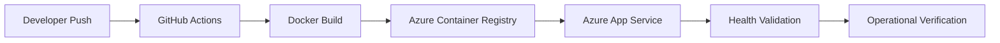

---

# 7. Health & Readiness Evolution

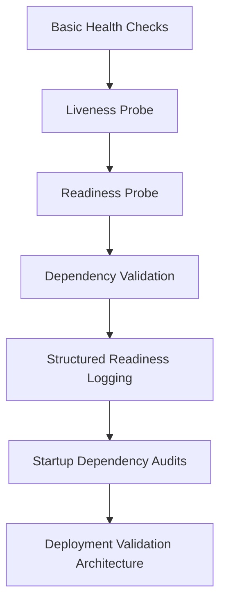

---

# 8. Security Evolution

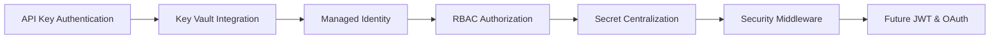

---

# 9. Repository & Project Structure

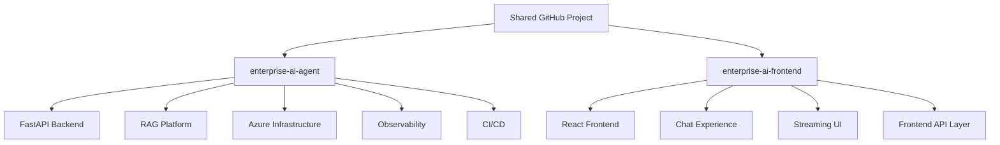

---

# 10. Current Platform Status

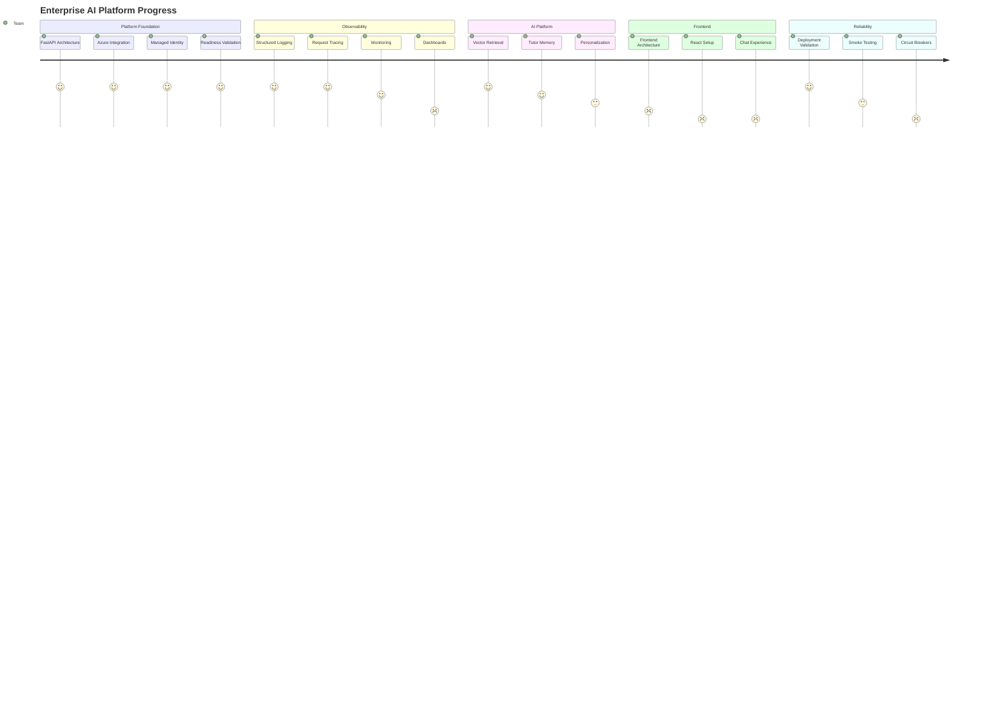

---

# 11. Current Engineering Execution Model

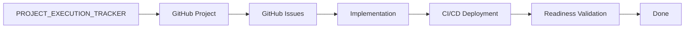

---

# 12. Future Platform Direction

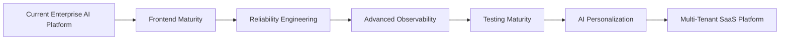

